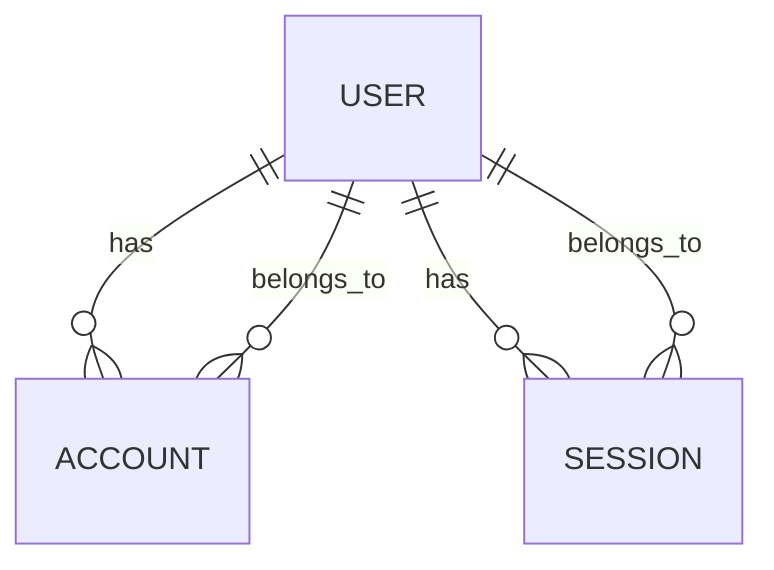
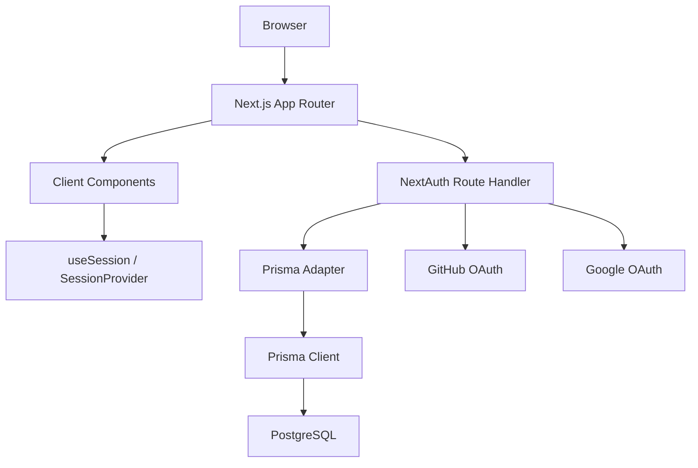
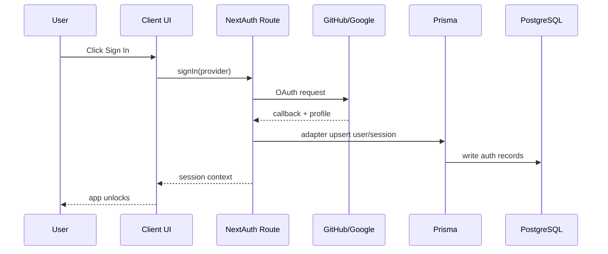
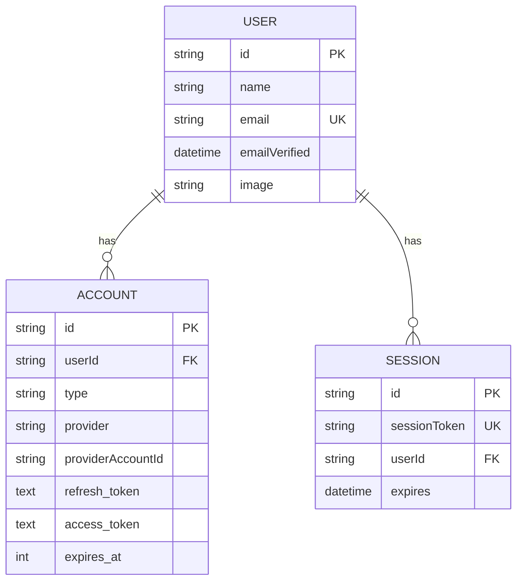

# Keeper Project Architecture

This document describes the repository as it actually exists in source code and configuration. It is the project-specific technical map for future work.

## 1. System overview

The application in this repository is a note-taking app modeled on the classic “Keeper” pattern: users can create and delete notes, and the home page shows a note list with a header and footer.

The codebase also includes an authentication layer based on NextAuth and Prisma, with GitHub and Google OAuth providers configured. In practice, the repo is a prototype / starter app with two overlapping layers:

- a client-side notes UI
- an auth scaffold wired to Prisma-backed OAuth session storage

The visible user-facing behavior is:

- unauthenticated users are blocked from the main notes page
- authenticated users can see the note interface
- note creation and deletion are local client-state operations
- OAuth sign-in is intended to happen through NextAuth

Main application responsibilities:

- render the homeowner / notes page
- authenticate users via social providers
- maintain a session for authenticated users
- allow note creation and deletion in the UI
- provide auth-related pages for login, sign-up, and password reset

Major subsystems:

- App shell and layout (`app/layout.tsx`, `app/page.tsx`)
- note UI (`app/components/*`)
- NextAuth route and provider setup (`app/api/auth/[...nextauth]/route.ts`)
- Prisma schema and database connection (`prisma/schema.prisma`, `lib/prisma.ts`)
- MUI theme and styling (`app/ThemeRegistry.tsx`, `app/theme.ts`, `app/globals.css`)
- auth UI pages (`app/(auth)/*`)

## 2. Tech stack

### Next.js
- Version: `16.2.12`
- Purpose: application framework and routing
- Used in: `package.json`, `next.config.ts`, `app/`, route structure
- Depends on: Node runtime, React, Turbopack build configuration

### React
- Version: `19.2.4`
- Purpose: UI rendering
- Used in: all app components, `useState`, event handlers
- Depends on: component model and client-side rendering

### TypeScript
- Version: `^5`
- Purpose: type checking and app safety
- Used in: all `.ts` and `.tsx` files, `tsconfig.json`
- Important configuration:
  - `strict: true`
  - `jsx: "react-jsx"`
  - `moduleResolution: "bundler"`
  - `paths: { "@/*": ["./*"] }`

### Database
- Database: PostgreSQL (intended / configured in Prisma schema)
- Source evidence: `prisma/schema.prisma` declares `datasource db { provider = "postgresql" }`
- `.env` contains `DATABASE_URL=...`
- Actual database is not yet initialized in repo artifacts as no migration folder exists

### ORM
- Prisma 7.9.1
- Purpose: schema definition, Prisma Client, auth adapter integration
- Used in: `prisma/schema.prisma`, `lib/prisma.ts`, `app/api/auth/[...nextauth]/route.ts`
- Depends on: PostgreSQL environment configuration and generated client

### Authentication
- NextAuth 4.24.15
- Purpose: OAuth sign-in and session management
- Used in: `app/api/auth/[...nextauth]/route.ts`, `app/layout.tsx`, `app/page.tsx`, `app/components/AuthButtons.tsx`
- Providers: GitHub and Google
- Session strategy: `jwt`

### UI libraries
- MUI (`@mui/material`, `@mui/icons-material`)
- Purpose: buttons, icons, layout primitives, Material UI theme integration
- Used in: `Header.tsx`, `AuthButtons.tsx`, `CreateArea.tsx`, `Note.tsx`, `ThemeRegistry.tsx`
- Emotion packages are used by MUI

### Styling
- Tailwind CSS v4 (`tailwindcss`, `@tailwindcss/postcss`)
- Purpose: utility styles and global CSS import
- Used in: `app/globals.css`
- There is also custom CSS for the original Keeper design

### State management
- Local component state via `useState`
- Session state via `useSession` from `next-auth/react`
- No Redux, Zustand, React Query, or global store is present
- No custom server state management library exists

### Validation
- HTML form validation via `required` attributes
- Simple guard conditions in UI code (`if (note.title.trim() === "" && note.content.trim() === "") return;`)
- No form library, schema validator, or API validation framework is evident in the repo

### APIs
- One actual route handler: `/api/auth/[...nextauth]`
- No custom REST API routes or server actions are present in the app code

### External services
- GitHub OAuth
- Google OAuth
- PostgreSQL database

### Payments
- No payment system is present in the repository.
- No Stripe, Paddle, or similar dependency exists.

### Email
- No email service integration is present.
- The forgot-password page is static UI only; no mailer or reset token implementation exists.

### Storage
- No object storage, CDN, or bucket setup is present.
- User data persistence is not implemented beyond auth tables defined in Prisma schema.

### Testing
- No testing framework or test files are present.
- There is no `test` script in `package.json`.

### Deployment
- No explicit deployment config is present.
- There is no Dockerfile, Vercel config, infrastructure-as-code, or deployment manifest in the repo root.
- Deployment platform is `UNKNOWN / NEEDS VERIFICATION`.

## 3. Repository structure

### `/app`
Purpose: App Router entry point for all pages and layouts.

Important files:
- `app/layout.tsx`: root layout and `SessionProvider`
- `app/page.tsx`: authenticated home page with notes
- `app/globals.css`: global styles
- `app/ThemeRegistry.tsx`: MUI Emotion SSR cache setup
- `app/theme.ts`: MUI theme stub
- `app/(auth)/` routes: login, sign-up, forgot-password
- `app/api/auth/[...nextauth]/route.ts`: NextAuth API route

Architectural role:
- this is the user-facing app shell and routing boundary

### `/app/components`
Purpose: reusable UI components for the note-taking app and auth controls.

Important files:
- `Header.tsx`: top navigation/header
- `AuthButtons.tsx`: sign in/out controls
- `CreateArea.tsx`: note creation form
- `Note.tsx`: rendered note card
- `Footer.tsx`: simple footer with year

### `/lib`
Purpose: shared server-side utilities and singletons.

Important file:
- `lib/prisma.ts`: singleton `PrismaClient` instance

### `/prisma`
Purpose: Prisma schema and schema config.

Important files:
- `prisma/schema.prisma`: auth schema models
- `prisma.config.ts`: Prisma v7 config and `DATABASE_URL` wiring

### `/public`
Purpose: static assets.

Current role: minimal app assets; no custom project assets are obviously central to functionality.

### `/react_one`
Purpose: leftover original React implementation.

Evidence:
- contains a classic React note app with `Header`, `CreateArea`, `Note`, `Footer`, and similar components
- likely the source from which the Keeper-style UI was adapted

Architectural role:
- historical artifact or migration scaffold; not part of the active Next.js App Router app

### `/node_modules`
Purpose: installed dependency tree.

Not source code; not part of architecture design.

### `/` root files
Important files:
- `package.json`: dependencies and scripts
- `tsconfig.json`: TypeScript configuration
- `next.config.ts`: Next config stub
- `eslint.config.mjs`: lint configuration
- `.env`: environment variables
- `README.md`: setup notes for NextAuth + Prisma
- `.gitignore`: repo ignores

## 4. Application architecture

Actual runtime architecture:

```text
Browser
  ↓
Next.js App Router
  ↓
Client Components
  ├─ app/page.tsx
  ├─ app/components/Header.tsx
  ├─ app/components/AuthButtons.tsx
  ├─ app/components/CreateArea.tsx
  ├─ app/components/Note.tsx
  ├─ auth pages under app/(auth)
  ↓
NextAuth route handler
  └─ app/api/auth/[...nextauth]/route.ts
      ↓
      Prisma Adapter
      ↓
      Prisma Client
      ↓
      PostgreSQL database (intended)
```

Important nuance: the note feature does not flow through a server action or API. It is entirely local to the browser state.

## 5. Server / client boundaries

### Server Components
The project does not appear to deliberately use server components for application logic. The root layout is a server component by default because it is an App Router layout file without `'use client'`.

Observations:
- `app/layout.tsx` is a server component because it imports `metadata` and configures `SessionProvider`
- `app/page.tsx` is a client component (`'use client'`)
- `app/components/*` are all client components because they rely on browser interactions or React hooks

### Client Components
The following are client components:

- `app/page.tsx`
- `app/components/Header.tsx`
- `app/components/AuthButtons.tsx`
- `app/components/CreateArea.tsx`
- `app/components/Note.tsx`
- `app/components/Footer.tsx`
- all pages inside `app/(auth)`

Reasons:

- they use `useState`
- they use `useSession`
- they handle browser event handlers
- they render provider callbacks such as `signIn` / `signOut`

### `use client`
The repo uses `'use client'` in a classic way for interactive components. There are no server actions or `'use server'` calls in the repository.

### Server-side operations
The actual server-level operations are limited to:

- NextAuth endpoint processing
- Prisma database access through the singleton client
- server-side rendering of the root layout and metadata

There are no route handlers beyond auth. There are no custom server actions for notes or CRUD.

### Data crossing boundary
Auth data crosses the server/client boundary through:

- `SessionProvider` in `app/layout.tsx`
- `useSession()` in client components
- NextAuth underlying cookie/session handling

Notes data does not cross the server boundary at all; it is local to the browser state.

## 6. Routing

### Main routes
The actual routes visible in the repo are:

- `/` — `app/page.tsx`
- `/login` — `app/(auth)/login/page.tsx`
- `/sign-up` — `app/(auth)/sign-up/page.tsx`
- `/forgot-password` — `app/(auth)/forgot-password/page.tsx`
- `/api/auth/[...nextauth]` — auth API route

### Route groups
- `app/(auth)` is a route group.
- It organizes related auth pages without creating a URL segment.

### Layouts
- `app/layout.tsx` is the root layout.
- `app/(auth)/layout.tsx` is a nested auth layout.

### Protected routes
The home page is gated by session status:

- if `status === "loading"`, show loading text
- if `status === "unauthenticated"`, show sign-in prompt
- else render notes app

This is client-side route protection only.

### Middleware behavior
There is no `middleware.ts` file in the repository.

Therefore:
- no server-side middleware-based protection
- no request interception for auth or redirects
- no edge middleware behavior is active

### Loading / error / not-found
No actual `loading.tsx`, `error.tsx`, or `not-found.tsx` files exist.

## 7. Data flow

### Authentication flow
`AuthButtons.tsx` or `app/page.tsx`
action: click sign-in button
→ `signIn('google')` / `signIn('github')` from `next-auth/react`
→ NextAuth route: `/api/auth/[...nextauth]/route.ts`
→ provider challenge and callback
→ Prisma adapter writes user/account/session records to PostgreSQL
→ `SessionProvider` exposes session to client components
→ `useSession()` updates UI state
→ app page renders notes or sign-in prompt

### Notes create flow
`CreateArea.tsx`
→ user fills title/content
→ submit event triggers `submitNote`
→ if title and content are both empty, abort
→ `onAdd(note)` callback runs from `app/page.tsx`
→ `setNotes(prev => [...prev, newNote])`
→ `Note` components re-render with list state

### Notes delete flow
`Note.tsx`
→ button click triggers `handleClick`
→ `props.onDelete(props.id)`
→ `deleteNote` in `app/page.tsx`
→ `setNotes(prev => prev.filter(...))`
→ list re-renders

This is entirely browser memory state; no database, server action, or API call exists.

### Data flow from auth pages
The auth pages (`login`, `sign-up`, `forgot-password`) collect form state with `useState` and log values to the console. There is no request to the backend or database.

## 8. Database architecture

The database is defined in `prisma/schema.prisma`.

```prisma
model User {
  id            String    @id @default(cuid())
  name          String?
  email         String?   @unique
  emailVerified DateTime?
  image         String?
  accounts      Account[]
  sessions      Session[]
}

model Account {
  id                String  @id @default(cuid())
  userId            String
  type              String
  provider          String
  providerAccountId String
  refresh_token     String? @db.Text
  access_token      String? @db.Text
  expires_at        Int?
  token_type        String?
  scope             String?
  id_token          String? @db.Text
  session_state     String?
  user User @relation(fields: [userId], references: [id], onDelete: Cascade)
  @@unique([provider, providerAccountId])
}

model Session {
  id           String   @id @default(cuid())
  sessionToken String   @unique
  userId       String
  expires      DateTime
  user         User     @relation(fields: [userId], references: [id], onDelete: Cascade)
}

model VerificationToken {
  identifier String
  token      String   @unique
  expires    DateTime
  @@unique([identifier, token])
}
```

### Relationships



### Primary keys
- `User.id`
- `Account.id`
- `Session.id`
- `VerificationToken` has no single ID; uniqueness is enforced by composite/unique token

### Foreign keys
- `Account.userId -> User.id`
- `Session.userId -> User.id`

### Constraints
- `User.email` is unique
- `Session.sessionToken` is unique
- `Account` has unique combination of `(provider, providerAccountId)`
- `VerificationToken` has unique combination of `(identifier, token)`
- cascade deletes from `User` to related `Account` and `Session`

### Indexes
The schema uses database uniqueness constraints; there are no additional custom indexes defined.

### Business-critical data
- user identity and email
- OAuth provider account linkage
- active sessions and expiry
- email verification state
- auth tokens for provider integration

### Important queries / mutations
The repository itself does not define custom Prisma queries for business logic. The only actual query/update structure is the auth adapter and Prisma Client integration.

This means:
- app-specific business queries are not implemented yet
- database writes occur through NextAuth internals, not application-specific service code

## 9. Authentication

### Provider configuration
`app/api/auth/[...nextauth]/route.ts` configures:

- `GitHubProvider`
- `GoogleProvider`
- `PrismaAdapter(prisma)`
- `secret: process.env.NEXTAUTH_SECRET`
- `session.strategy = "jwt"`

### Auth route
The file exports:

```ts
const handler = NextAuth(authOptions);
export { handler as GET, handler as POST };
```

This is the canonical NextAuth route used by `/api/auth/[...nextauth]`.

### Session provider
`app/layout.tsx` wraps the app in:

```tsx
<SessionProvider>
  <ThemeRegistry>{children}</ThemeRegistry>
</SessionProvider>
```

This makes session data available through React context for the client app.

### Protected app page
`app/page.tsx` checks `useSession()` and gates content based on status:

- loading
- unauthenticated
- authenticated

### Authorization
There is no role-based authorization model, permissions system, or middleware permission check in the repository.

### Cookies
Session cookies are handled by NextAuth internally; the repo does not contain custom cookie configuration.

### Security boundaries
Current auth model is limited to:
- provider sign-in via OAuth
- session context on client
- Prisma persistence of auth tables

There is no server-side authorization enforcement beyond the frontend gate in `app/page.tsx`.

## 10. Major features

### Notes app
Purpose: manage notes in a Keeper-style UI.

Main UI:
- `app/page.tsx`
- `CreateArea.tsx`
- `Note.tsx`
- `Header.tsx`
- `Footer.tsx`

Interaction:
- create note
- delete note
- render note list
- no persistence

Important files:
- `app/page.tsx`
- `app/components/CreateArea.tsx`
- `app/components/Note.tsx`

### Authentication
Purpose: sign in with GitHub or Google and keep session state.

Main UI:
- `app/components/AuthButtons.tsx`
- auth pages in `app/(auth)`
- `app/page.tsx` auth gate

Important files:
- `app/api/auth/[...nextauth]/route.ts`
- `app/layout.tsx`
- `lib/prisma.ts`
- `prisma/schema.prisma`

### Auth form pages
Purpose: user-facing login, sign-up, forgot-password screens.

Important files:
- `app/(auth)/login/page.tsx`
- `app/(auth)/sign-up/page.tsx`
- `app/(auth)/forgot-password/page.tsx`

Important observation:
- These pages are form UIs only; they do not integrate with actual auth logic, APIs, or database operations.

## 11. Component architecture

### `app/page.tsx`
Purpose: main protected app screen.

Responsibilities:
- check session status with `useSession`
- render sign-in prompt if unauthenticated
- render header, create area, notes, footer when authenticated
- manage note list state with `useState`

### `Header.tsx`
Purpose: app header with branding and auth controls.

Depends on:
- `AuthButtons`
- MUI `HighlightIcon`

### `AuthButtons.tsx`
Purpose: show sign-in / sign-out controls based on session.

Depends on:
- `next-auth/react`
- MUI `Button`, `Typography`, `Box`

### `CreateArea.tsx`
Purpose: note compose form.

Props:
- `onAdd: (note) => void`

Behavior:
- expand/collapse note textarea
- handle input updates
- ignore empty submissions
- call `onAdd` on valid submit

### `Note.tsx`
Purpose: render a single note card with delete action.

Props:
- `id`, `title`, `content`, `onDelete`

### `ThemeRegistry.tsx`
Purpose: manage Emotion cache and apply MUI theme to the app.

Depends on:
- `@emotion/cache`
- `@emotion/react`
- `@mui/material/styles`

### `app/(auth)/layout.tsx`
Purpose: auth route layout.

Important issue: it defines its own `<html>` and `<body>` tags, which is unusual in nested App Router layouts and can create invalid nesting assumptions. This is a fragile architectural point.

## 12. State management

### Local state
Used in:
- `app/page.tsx` for `notes`
- `CreateArea.tsx` for `note` and `isExpanded`
- auth pages for form values via `useState`

### Global state
There is no app-wide state library.

### Session state
Provided through `SessionProvider` and `useSession` from NextAuth.

### Persistence
- notes are not persisted
- auth sessions are persisted by NextAuth with Prisma backend (intended)

### URL state
No route query state or URL-based state management is implemented.

## 13. Forms and validation

The repository uses very simple form patterns:

- controlled inputs with `useState`
- `onChange` updates a field
- `onSubmit` handler executes logic
- HTML `required` attributes are used for basic validation

Important examples:
- `app/(auth)/login/page.tsx`
- `app/(auth)/sign-up/page.tsx`
- `app/(auth)/forgot-password/page.tsx`
- `app/components/CreateArea.tsx`

Validation is mostly UI-level and not backed by a library or backend enforcement.

Actual validation behaviors seen:
- in `CreateArea.tsx`, empty note submissions are ignored
- login/signup fields use `required`
- there are no schema validation libraries or typed form validators

## 14. External services

### GitHub OAuth
- Purpose: social login
- Integration: `GitHubProvider` in `app/api/auth/[...nextauth]/route.ts`
- Credentials: `GITHUB_ID`, `GITHUB_SECRET`
- Data flow: provider callback → Prisma adapter → session

### Google OAuth
- Purpose: social login
- Integration: `GoogleProvider` in same auth route
- Credentials: `GOOGLE_ID`, `GOOGLE_SECRET`

### PostgreSQL
- Purpose: persistent auth/session storage via Prisma
- Integration: `DATABASE_URL` and Prisma schema
- Configuration: `prisma.config.ts` and `.env`

### No other external service integrations exist
- no payments
- no email
- no storage
- no CDN usage beyond a remote background pattern image in CSS

## 15. Configuration and environment

Important config files:

- `package.json`: scripts and dependencies
- `next.config.ts`: project config (currently empty)
- `tsconfig.json`: TypeScript compiler configuration
- `eslint.config.mjs`: ESLint config
- `prisma.config.ts`: Prisma-specific config
- `.env`: runtime environment variables

Environment variables present:

- `DATABASE_URL`
- `GITHUB_ID`
- `GITHUB_SECRET`
- `GOOGLE_ID`
- `GOOGLE_SECRET`
- `NEXTAUTH_SECRET`

These are consumed by:

- `prisma.config.ts` for Prisma datasource config
- `app/api/auth/[...nextauth]/route.ts` for OAuth provider config

No secret values are included in this repo; placeholders are used.

## 16. Business logic

The repository does not yet implement a broad business domain beyond basic note-taking and auth.

Documented business rules actually present:

- only authenticated users are allowed to view the main notes page (`app/page.tsx`)
- empty note submissions are rejected in `CreateArea.tsx`
- note deletion removes the item by index in the notes array
- session state is required to access the app

No pricing, inventory, orders, checkout, discounts, permissions, team roles, or payment rules exist in this codebase.

## 17. Error handling

The actual error handling is minimal.

Observed patterns:

- `CreateArea.tsx` silently returns for empty notes
- `AuthButtons.tsx` handles loading state
- `app/page.tsx` handles loading and unauthenticated states
- there are no `try/catch` blocks around database work in application code
- there are no custom error boundaries
- there is no logging framework or error reporting integration

This means the app is fragile in production-like conditions because DB/auth failures will depend on framework defaults rather than custom handling.

## 18. Caching and data fetching

No custom data-fetching layer is implemented.

Observed patterns:

- `useState` is used for in-memory note data
- `useSession` fetches session state from NextAuth context
- no `fetch()` calls in app code for project business data
- no `cache`, `revalidate`, or `dynamic = 'force-dynamic'` usage is evident
- no server components with async data fetching are present

This project is effectively a client-side interactive app with session context, not a server-rendered data-heavy application.

## 19. Security architecture

### Authentication
- OAuth sign-in via GitHub and Google
- NextAuth session strategy: JWT
- session provider wraps app

### Authorization
- UI-level gate only, no server-side authorization enforcement
- there is no middleware or server permission system

### Input validation
- simple HTML validation and local checks exist
- no schema-based validation or server-side sanitization

### Secrets
- sensitive values live in `.env` and are required by provider configuration and Prisma
- no secret management abstraction is present

### Cookies
- managed by NextAuth internally
- no custom cookie rules or security flags are defined in repo code

### Database access
- Prisma instance is centralized in `lib/prisma.ts`
- auth DB access is through the adapter and client; no custom SQL is executed by app code

### API protection
- the auth route exists, but there are no custom protected APIs
- no authorization middleware is present

### Sensitive caution areas
- `app/api/auth/[...nextauth]/route.ts`
- `.env`
- `prisma/schema.prisma`
- `lib/prisma.ts`
- any future addition of user-specific data should be protected server-side, not only client-side

## 20. Testing

There are no test files or test framework dependencies in the repository.

Evidence:
- no `*.test.*` or `*.spec.*` files found
- no testing libraries in `package.json`
- no `test` script in scripts section

This means architecture changes are currently not protected by automated tests.

## 21. Deployment

Actual deployment architecture:

- standard Next.js application
- static assets and app routes handled by Next.js runtime
- PostgreSQL database is required for auth storage
- OAuth providers require external credentials

What is not present:
- Dockerfile
- CI/CD workflow
- deployment manifest
- serverless config
- infrastructure code

Deployment platform: `UNKNOWN / NEEDS VERIFICATION`

## 22. Critical files

### `package.json`
Purpose: dependency and script definition.

Depends on: installed Node packages.

Dependents: local dev environment, build, linting, runtime.

Why it matters: defines the actual runtime stack and scripts.

What could break if modified: app build, install, runtime consistency.

### `app/page.tsx`
Purpose: main authenticated app screen.

Depends on: `useSession`, `Header`, `CreateArea`, `Note`.

Dependents: user entry point.

Why it matters: it gates access and orchestrates the note UI.

Risk: changing this affects the app’s core user experience and auth flow.

### `app/layout.tsx`
Purpose: root layout and session context provider.

Depends on: `SessionProvider`, MUI theme registry.

Dependents: entire application tree.

Why it matters: provides auth context to all descendants.

Risk: removing or breaking it breaks session access in the app.

### `app/api/auth/[...nextauth]/route.ts`
Purpose: authentication entry point.

Depends on: NextAuth, Prisma adapter, env vars.

Dependents: Google/GitHub OAuth, session state, user creation.

Why it matters: this is the heart of the auth system.

Risk: provider misconfiguration or type mismatch will break sign-in.

### `prisma/schema.prisma`
Purpose: database model for auth entities.

Depends on: Prisma and Postgres database.

Dependents: auth session storage, Prisma Client usage.

Why it matters: defines user/account/session relations.

Risk: schema changes affect persisted auth data model and adapter behavior.

### `lib/prisma.ts`
Purpose: singleton Prisma client.

Depends on: `@prisma/client`.

Dependents: adapter and any future Prisma calls.

Why it matters: centralizes the DB connection.

Risk: changing client creation affects all DB-backed features.

### `app/components/AuthButtons.tsx`
Purpose: sign-in/out UI.

Depends on: `next-auth/react`.

Dependents: header and auth UX.

Why it matters: primary visible sign-in experience.

Risk: broken sign-in flow will affect app usability.

### `app/components/CreateArea.tsx`
Purpose: note creation form.

Depends on: `onAdd` callback and React state.

Dependents: notes functionality.

Why it matters: user entry point for creating notes.

Risk: logic change affects note creation behavior.

### `app/components/Note.tsx`
Purpose: note display and deletion.

Depends on: note props and delete callback.

Dependents: notes list UI.

Why it matters: user can remove notes.

Risk: delete behavior or display change affects the app’s main feature.

### `app/globals.css`
Purpose: global styling and the legacy Keeper CSS.

Depends on: Tailwind and custom CSS.

Dependents: whole app styling.

Why it matters: it controls note card and layout style.

Risk: style changes can affect layout and visual identity.

## 23. Common modification paths

### Add a page
- create a file under `app/.../page.tsx`
- decide whether it needs `use client`
- decide whether it should be in a route group or not
- if it needs auth gating, use `useSession()` like `app/page.tsx`

### Add a component
- create or place under `app/components`
- decide if it needs client-side interactivity
- keep styling consistent with current MUI/Tailwind usage

### Add a feature
- determine whether it belongs in client state or in a backend service
- avoid adding an ad hoc service layer when the repo has no established feature architecture
- if DB-backed, add Prisma model and use `lib/prisma.ts`

### Modify a database model
- update `prisma/schema.prisma`
- generate a migration and apply it
- ensure Prisma adapter compatibility with auth models remains intact

### Add a server action
- there is no established server action pattern yet
- if added, it should be placed in an App Router file with explicit `'use server'`
- but current repo has none, so this is not a standard pattern yet

### Add an API
- prefer route handlers under `app/api/.../route.ts`
- follow the existing auth route pattern
- add validation and error handling explicitly, because none is in place today

### Modify authentication
- update `app/api/auth/[...nextauth]/route.ts`
- verify environment variables and `NEXTAUTH_SECRET`
- verify Prisma schema compatibility
- ensure `SessionProvider` remains in root layout

### Modify forms
- use controlled inputs and `useState`
- add validation locally if needed
- make sure server-side validation is added when a backend is introduced

### Modify styling
- `app/globals.css` for legacy styles
- `ThemeRegistry.tsx` for MUI theme injection
- UI-specific styling can be done with MUI props or Tailwind classes

### Modify navigation
- update links in page components
- ensure actual routes exist in `app/`
- watch for mismatched paths such as `/register` vs `/sign-up`

### Add validation
- verify current app pattern has no central validation layer
- add explicit checks near form handlers or server routes
- do not rely only on browser `required` attributes for production-grade validation

### Add tests
- there is currently no standard test setup
- adding tests would require introducing a framework and structure

## 24. Architectural dependencies

### Authentication depends on
- `SessionProvider`
- `next-auth/react`
- Prisma adapter
- Postgres schema
- env secrets

If auth breaks, the app page blocks access to the main feature.

### Notes depend on
- `app/page.tsx` state
- `CreateArea.tsx` callback
- `Note.tsx` rendering
- UI only, no DB backend

If the app page state is refactored, the note list architecture must be rethought.

### Styling depends on
- `app/globals.css`
- `ThemeRegistry.tsx`
- MUI theme

If styling changes are made globally, they can affect note cards, layout, and auth page visuals.

### Prisma depends on
- `DATABASE_URL`
- schema definitions
- generated client

If schema or env config changes, all auth/session behavior is affected.

## 25. Architecture diagrams

### System architecture



### Authentication flow



### Database model



## 26. Current architectural risks

### Bugs
- build currently fails due to a TypeScript mismatch in the NextAuth route: `session.strategy` is inferred as a string instead of the expected session strategy type
- the auth pages do not actually call the auth backend
- the auth route group layout includes `<html>` and `<body>` tags in a nested route layout, which is structurally fragile
- `/register` is referenced in `app/(auth)/layout.tsx`, but the actual route is `/sign-up`
- notes are not persisted and vanish when the page reloads

### Fragile architecture
- the app is split between a client-side notes app and a Prisma-backed auth subsystem without a clear service layer
- there is no custom backend business logic or database usage for note storage
- there is no route middleware layer, so protection is entirely UI-level

### Technical debt
- `react_one/` is a legacy React app that likely represents old project state
- `app/globals.css` contains older non-Next styling and mixed conventions with Tailwind
- the project still contains default Next app metadata and default app names
- there are no tests, no API validation, and no formal error handling model

### Security concerns
- client-side protection is insufficient for real authorization
- no server-side auth enforcement exists beyond UI gating
- secrets are in `.env` and are required for runtime operation
- no production-grade validation layer exists

### Performance concerns
- notes are stored only in in-memory state; this is intentionally minimal but not persistent
- no caching strategy is implemented

### Areas needing verification
- actual deployment target
- actual production database setup
- whether the auth route is functioning in a real PostgreSQL environment
- whether the app is expected to remain locally authenticated or eventually add real app-specific data models

## 27. Project evolution

This project should evolve with a few clear principles:

- preserve the Keeper-style note-taking purpose
- preserve the existing App Router structure and file organization
- keep authentication and database concerns centralized in the existing NextAuth/Prisma pattern
- avoid introducing a broad framework or state library unless the project genuinely grows beyond the current scope
- do not rely on client-only auth gating for production-grade authorization
- add proper validation and backend flows when the app begins to manage real data beyond local notes
- keep `.env` and secrets isolated and do not embed them in source files
- avoid unnecessary rewrites of the legacy `react_one` code unless there is a deliberate migration plan

In short, the repository is best understood as a partial migration from a classic React note app to a Next.js + Prisma + NextAuth app, with the note storage and some auth flows still incomplete.

## Summary

This repo is not a large-scale production SaaS. It is a small app scaffold that combines:

- a classic Keeper notes UI
- a Next.js App Router shell
- Prisma-backed auth schema
- Google/GitHub OAuth sign-in via NextAuth
- minimal custom app logic and no strong backend patterns yet

The most important architectural rule for future changes is: keep the auth/database layer and the UI layer aware of each other, and avoid treating the current UI-only notes logic as a production persistence system.
